# Introduction
Step into a world where sustainability meets convenience with GreenPlate, the revolutionary app that transforms the way you manage your food. Say goodbye to food waste and hello to a greener lifestyle as GreenPlate empowers you to make conscious choices that benefit both your well-being and the planet. With our intuitive interface, you can effortlessly track your meals, curate your digital cookbook, and generate smart shopping lists that optimize your pantry and minimize waste. Embark on a journey towards a sustainable future, one delicious meal at a time, with GreenPlate as your trusted companion.

# Design & Architecture
GreenPlate's architecture follows the Model-View-ViewModel (MVVM) pattern. By separating the user interface logic from the business logic, MVVM promotes a clean and organized codebase that is easy to understand, test, and extend.

**Model** represents the data and business logic of the application. It encapsulates the data sources, such as our Firebase database, and provides a structured way to interact with the data. 

**View** is responsible for representing the user interface and providing an interactive experience to the users. It displays the data obtained from the ViewModel and handles user interactions, such as button clicks or input events. It also observes changes in the ViewModel and updates the UI accordingly, ensuring that the displayed information is always up to date.

**ViewModel** serves as an intermediary between the Model and the View layers. It contains the presentation logic and manages the state of the user interface, ensuring that the data is properly formatted and ready for display.

## Design Patterns
* Decorator Pattern

We employ the Decorator design pattern to enhance the functionality of ingredients without modifying the core Ingredient class. The Decorator pattern allows us to dynamically add behaviors or responsibilities to ingredients, providing a flexible and modular approach to ingredient management.
For example, by using CalorieExpIngredientDecorator, we can dynamically add the calorie and expiration date information to any Ingredient object without modifying its core implementation.

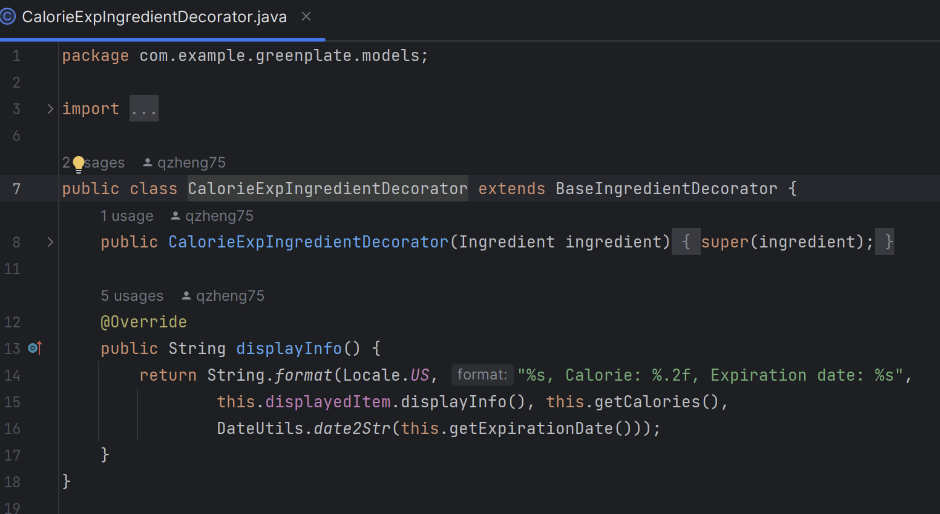

* Observer Pattern

We use the Observer pattern to efficiently handle updates when a recipe is cooked. The MealCalorieData observable holds the recipe and calorie data, and notifies two observers - CookUpdateToastMessageDisplay and CookUpdateMealAndDatabaseDisplay - when this data changes. These observers then perform their respective tasks of displaying a toast message and updating the database/UI. 

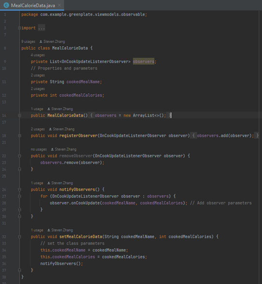

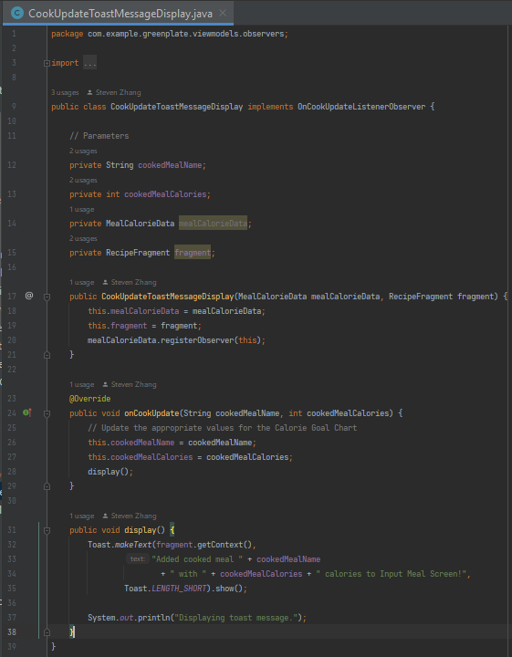

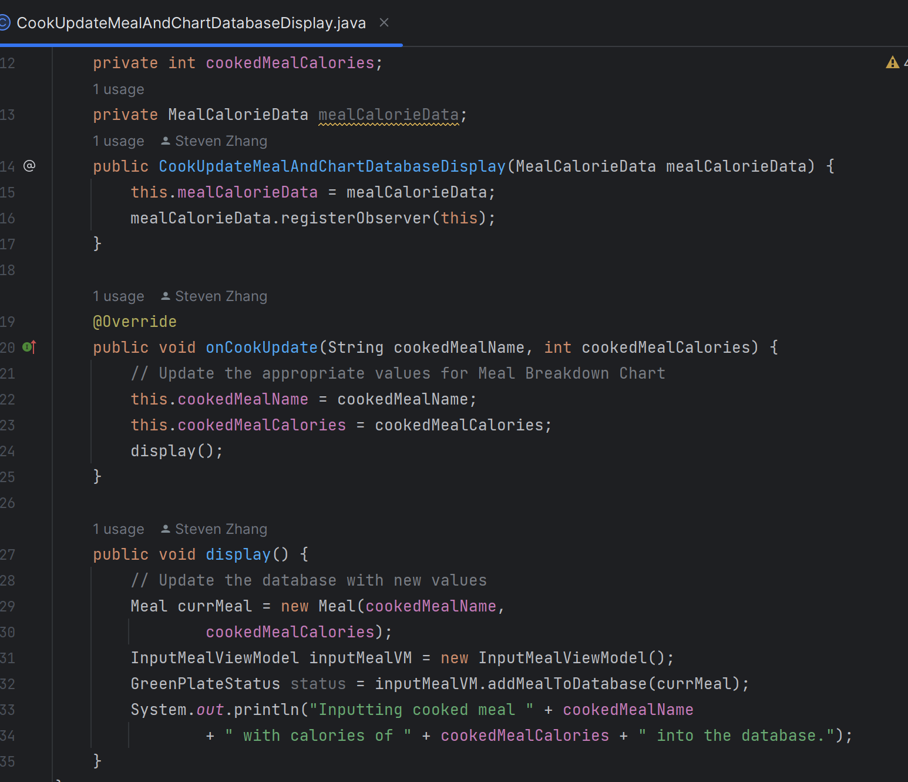

* Strategy Pattern 

We’ve defined a RecipeSortStrategy interface with a single method sort, which takes a list of RecipeAvailability objects. There are two concrete strategies, SortByNameStrategy and SortByIngredientCountStrategy that implement the interface, providing their sorting logic based on different criteria. 

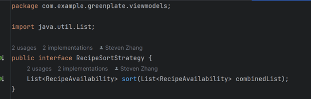

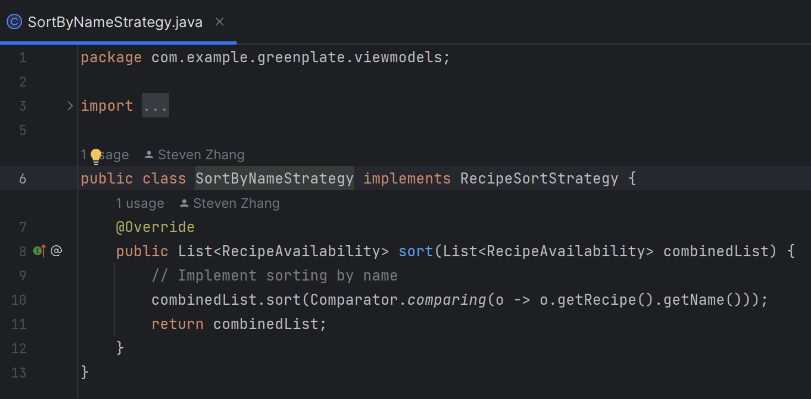

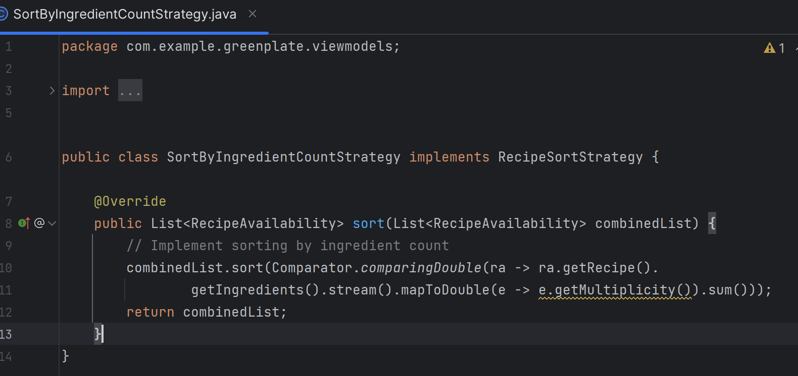

## Design Diagrams
Use Case Diagram

Domain Model

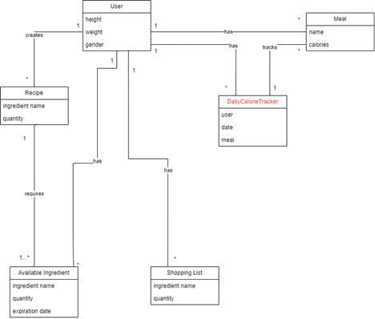

System Sequence Diagram

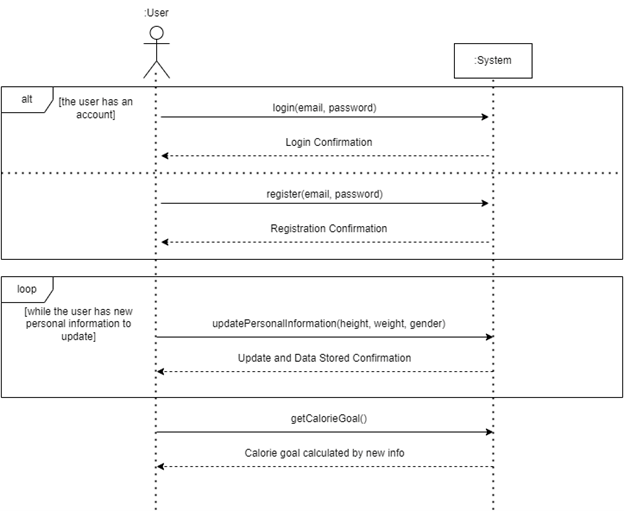

Sequence Diagram

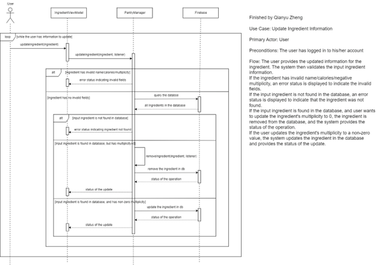

Domain Class Diagram

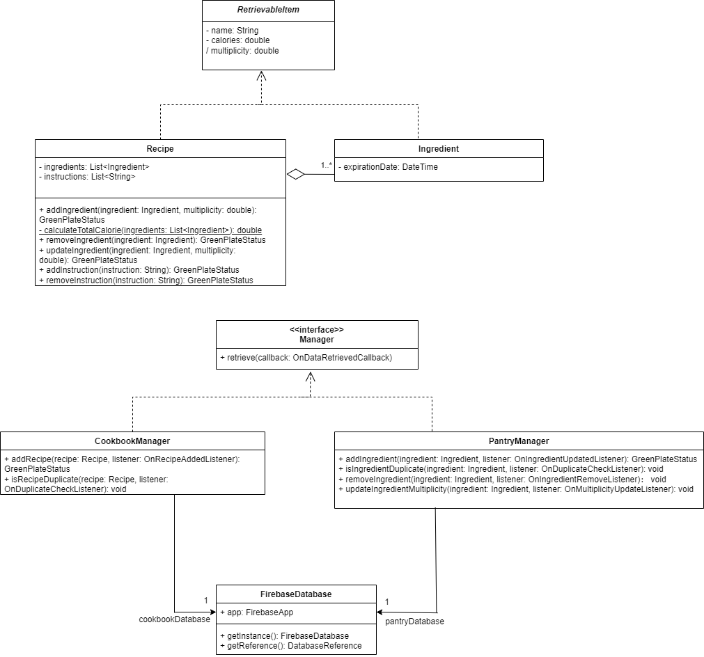

# User Interface (UI) 
We offer a comprehensive platform featuring various screens designed to enhance the user experience. Our login screen provides secure access, leading to the main dashboard where users can seamlessly navigate to different sections. The personal information screen allows users to view and modify essential details like age, height, weight, and gender. By simply clicking on the edit option, users can update any of this information effortlessly.

Within the application, users can input their meals on a dedicated screen, specifying the meal's name and calorie content. This feature enables users to track their daily calorie intake conveniently. Additionally, the shopping list screen empowers users to list the ingredients they need to purchase. They can edit these items and mark them as bought with a simple click, facilitating efficient grocery management. Once purchased, these ingredients automatically appear in the ingredient screen for easy reference.

In the recipe screen, users can access their collection of recipes and assess whether they possess the necessary ingredients to prepare each dish. They have the flexibility to sort recipes by name or quantity, streamlining the search process. Finally, the ingredient screen provides users with a comprehensive overview of their current ingredient inventory. Detailed information such as the number of ingredients, calorie content, and expiration dates is readily available, enabling users to plan their meals effectively.

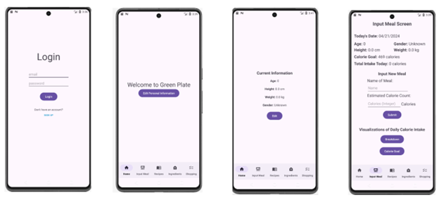

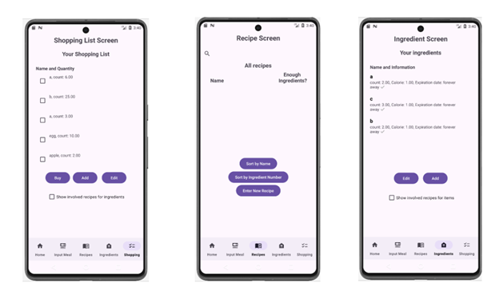

# Functionality Demo

# Conclusion

# Contribution
Contributors to app's development: Qianyu Zheng, Derek Huang, Steven Zhang, Wendy Pan, Hanyun Huang, Mingxuan Nie

Contributors to the website: Qianyu Zheng, Derek Huang, Steven Zhang, Wendy Pan, Hanyun Huang, Mingxuan Nie (aka everyone! yay!)